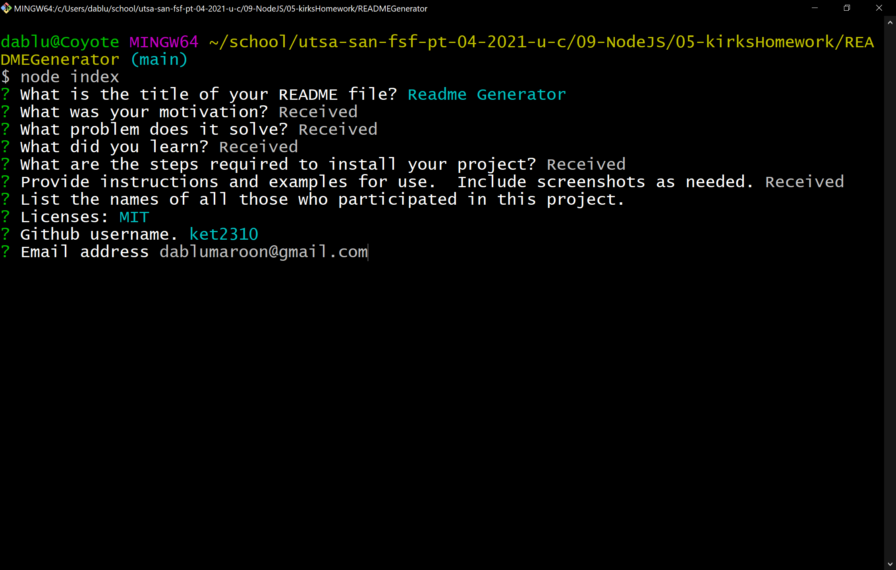

# README Generator 

## DESCRIPTION: 
	 * This application automates the creation of a README.md file.
 

## HOW TO INSTALL: 
	 * Type 'node index'. 

## USAGES: 
 

## CONTRIBUTING: 
	 *  There are many ways in which you can participate in this project, for example:

* [Submit bugs and feature requests](https://github.com/ket2310/READMEGenerator/issues), and help us verify as they are checked in
* Review [source code changes](https://github.com/ket2310/READMEGenerator/pulls)
 

## LICENCES: 
	 * MIT 

## QUESTIONS: 
	 * See github.com/ket2310 or email me at dablumaroon@gmail.com 

